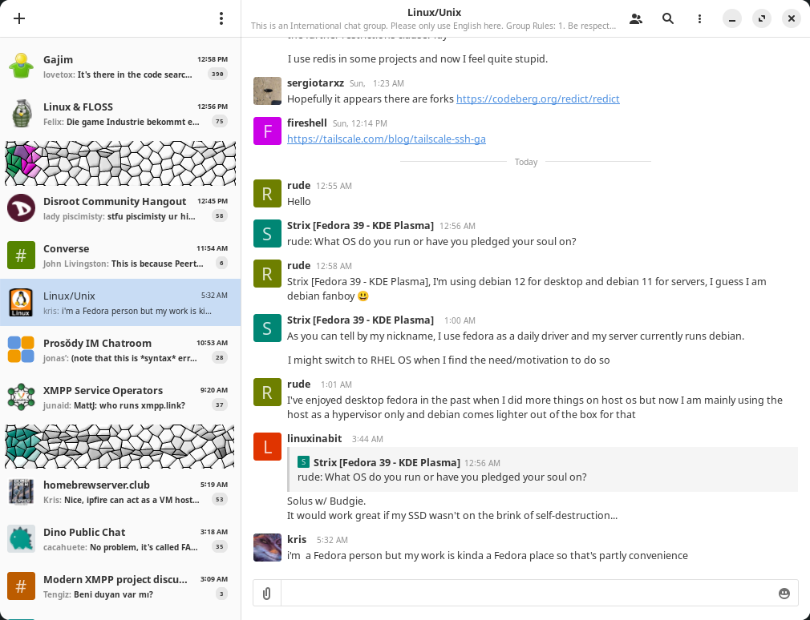

This is Dino+<br />
A modern XMPP/Jabber client software, based on [Dino](https://github.com/dino/dino/)
=======



Project description
------------
Dino+ is a fork of [Dino](https://github.com/dino/dino), a modern XMPP/Jabber client written in Vala using GTK+, which includes a few relatively minor but important quality-of-life features. 

It was created due to upstream project's maintainers being seemingly unwilling to accept PRs from the community. As of March 2024, there are over 50 PRs pending, most of which are silently ignored.

Some of the features that Dino+ implements:

* Windows support
* Proper sync for chats history, including "scroll-to-load"
* Forced MAM sync for chats
* Password change via GUI
* Optional support for Meson build system
* Some additional QoL-features

What's currently in the works:

* Multiple UI fixes
* Fixes for sound notifications
* MacOS support for Mac silicon
* and more

Dino+ is currently to be considered an alpha-quality product. Please open an issue or send a PR if you spot or fix any bugs.

OS support
------------
* Linux (flatpaks are targeted for Ubuntu 22.04+)
* Windows 10\11

We only support 64 bit platforms.

Installation (prebuilt packages)
------------
Have a look at our [releases](https://github.com/mxlgv/dino/releases).

Windows installer is self-explanatory, and will place a shortcut on your desktop. Ignore the possible warning from Windows Defender: it's caused by the fact that installer does not have a digital signature.

Flatpak is not present in Flathub yet, but you can install it manually. The commands below assume that you have "flatpak" package of your distro installed in your system. If it is not, please refer to https://flatpak.org/setup/

1) Download the .flatpak file from [releases](https://github.com/mxlgv/dino/releases)
2) Add default Flatpak repo:
    ```
    flatpak remote-add --if-not-exists flathub https://dl.flathub.org/repo/flathub.flatpakrepo
    ```
3) Change the directory to the one you've downloaded the .flatpak to and run:
    ```
    flatpak install ./im.dino.Dino.flatpak
    ```
4) To launch the program, run either
    ```
    /usr/bin/dino
    ```
    or
    ```
    flatpak run im.dino.Dino
    ```

Flatpak distribution is confirmed to be working on Arch Testing, Manjaro Stable and Void Linux.

Build on Linux
-----
Make sure to install all [dependencies](https://github.com/dino/dino/wiki/Build#dependencies).

    ./configure
    make
    build/dino

If you want to use `meson` build system, follow the next instructions:

    meson setup build -Dcrypto-backend=gnutls -Dplugin-ice=enabled
    meson configure --prefix $PWD/build/install --libdir lib build
    meson compile -C build
    meson install -C build
    LD_LIBRARY_PATH+=:$PWD/build/install/lib build/install/bin/dino

If your `nice` library depends on `libsoup-2.4` (consider `ldd` output for the `libnice.so`), you should additionally specify `-Duse-soup2=true` option.
`LD_LIBRARY_PATH` should point to the directory containing the `libdino.so` library.
Skip `meson configure` step, if you want to install the program globally.
You can specify any convenient directory in the option `--prefix` where the program will be installed.

Build on Windows (x86_64)
------------
- Install and configure the [MSYS2](https://www.msys2.org/) package;
- Go to `MINGW64` environment;
- Clone project:
    ```sh
    git clone https://github.com/mxlgv/dino && cd dino
    ```
- Run the script to install dependencies:
    ```sh
    ./build-win64.sh --prepare
    ```
- Start the build (the builded distribution is available in the `windows-installer/dist-win64` folder):
    ```sh
    ./build-win64.sh
    ```
If you want to use meson build system, please use `-s meson` key as the first argument, i.e.
   ```sh
   bash build-win64.sh -s meson -c -b
   ```
will do the same as commands above, but using meson.

Note: the build script has some other options, their description can be found using the `--help`.

Build Windows Installer (NSIS)
------------
Before this, you must build the project according to the instructions above. It's worth making sure that `windows-installer/dist-win64` is not empty.
Now you should run:
```sh
./build-win64.sh --build-installer
```

Resources
---------
- Original project's [website](https://dino.im).
- Dino's chat room `chat@dino.im` (please don't post there any issues related to this fork!)
- The upstream project's [wiki](https://github.com/dino/dino/wiki) provides additional information.

Contribute
----------
- Pull requests are welcome!
- Look at [how to debug](https://github.com/dino/dino/wiki/Debugging) Dino before you report a bug.
- Help [translating](https://github.com/dino/dino/wiki/Translations) Dino into your language.

Special thanks
----------
We'd like to thank all of the contributors whom provided the PRs used in this project.

We also recognise the previous efforts of [LAGonauta](https://github.com/LAGonauta) without whom Windows build wouldn't be available.

License
-------
    Dino+, a modern XMPP/Jabber client software based on Dino
    Copyright (C) 2016-2023 Dino contributors
    Copyright (C) 2024 Dino+ contributors

    This program is free software: you can redistribute it and/or modify
    it under the terms of the GNU General Public License as published by
    the Free Software Foundation, either version 3 of the License, or
    (at your option) any later version.

    This program is distributed in the hope that it will be useful,
    but WITHOUT ANY WARRANTY; without even the implied warranty of
    MERCHANTABILITY or FITNESS FOR A PARTICULAR PURPOSE.  See the
    GNU General Public License for more details.

    You should have received a copy of the GNU General Public License
    along with this program.  If not, see <http://www.gnu.org/licenses/>.
